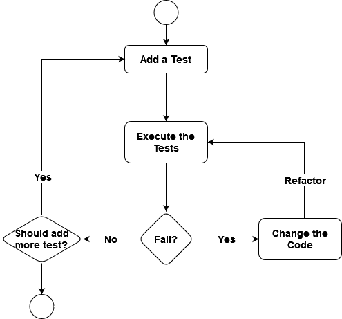
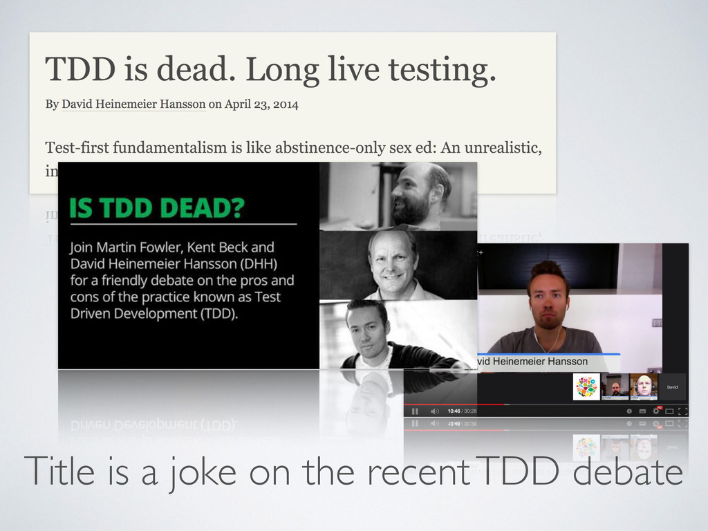
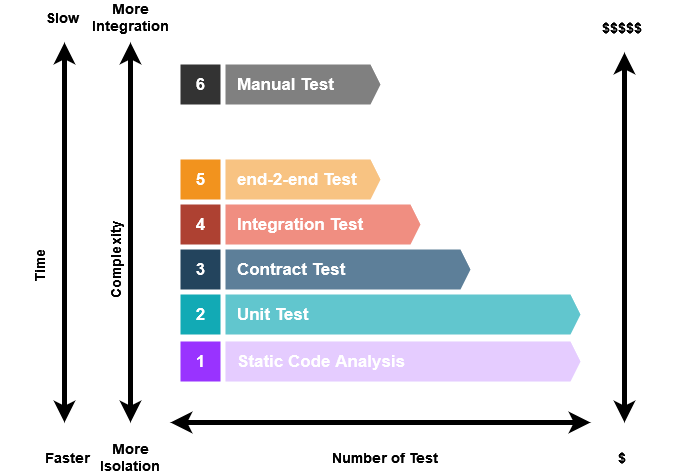
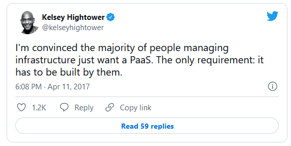
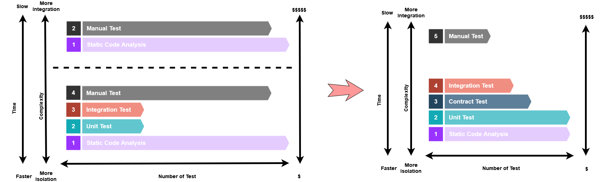
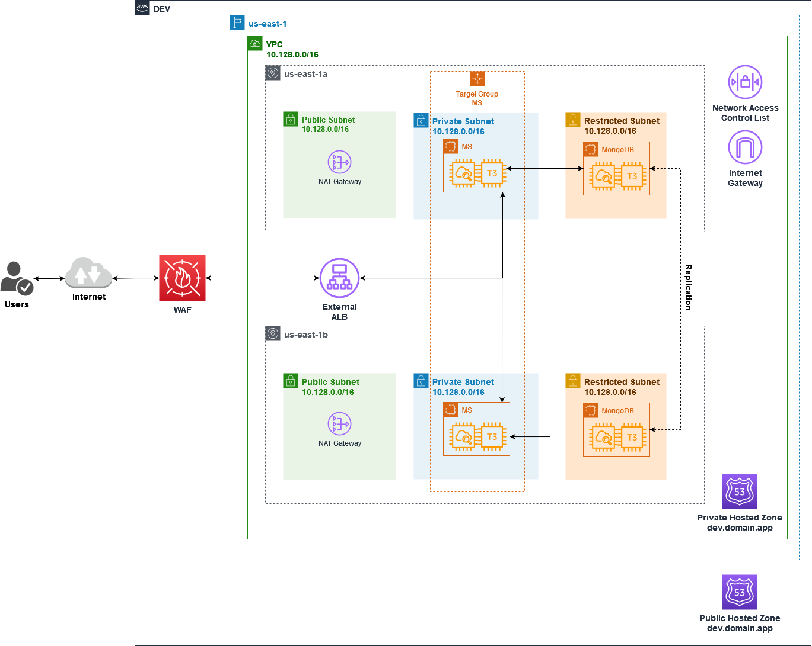
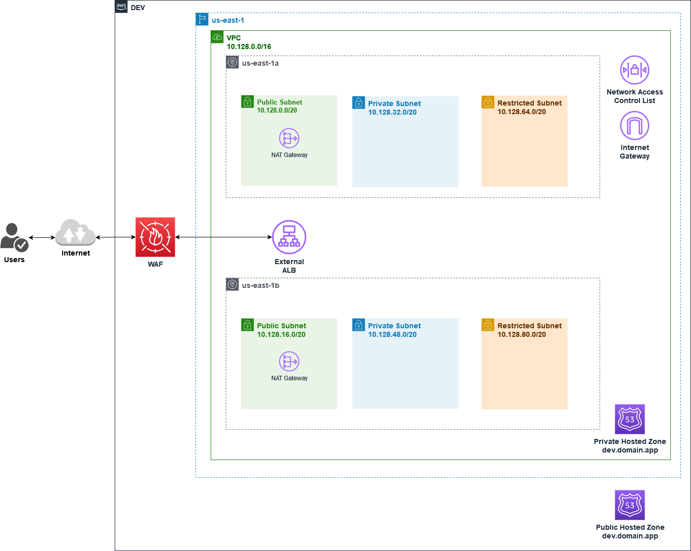
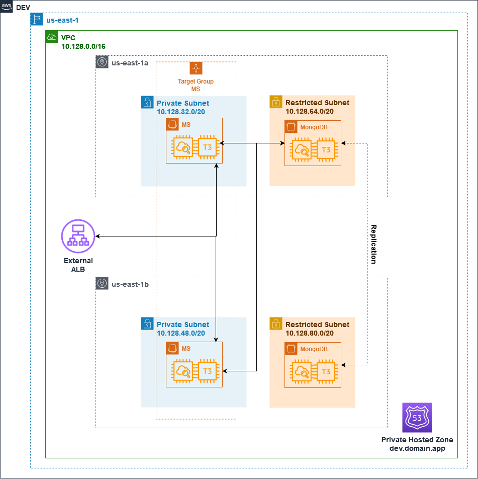
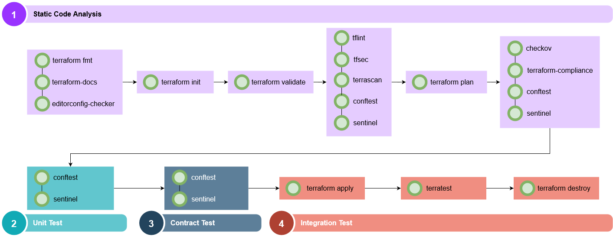

 

  

  <h3 align="center">Terraform Test-driven Development (TDD)</h3>

  

    Macro repository with DOCs, IaC, APP, and much more for Terraform TDD PoC `:wq`
     
    <a href="https://github.com/acactown/terraform-tdd/issues">Report Bug</a>
    ·
    <a href="https://github.com/acactown/terraform-tdd/projects/1">Request Feature</a>
  

## Table of Contents

* [About The Project](#about-the-project)
* [Prerequisites](#prerequisites)
* [Contributing](#contributing)
* [Contact](#contact)
* [Further Reading / Useful Links](#further-reading--useful-links)

## About The Project

> "In software development, `TDD` is the process of writing tests and then developing functionality to pass the tests. With `TDD`, only necessary functionality is implemented, cleaner code can be developed, and tests can be used as documentation for how something should work. But to do this, you need to know how to apply `TDD` to infrastructure and see if you realize the same benefits."
> __Rosemary Wang__

### TDD

> Write tests first, then write code (feature) that passes the tests!

In other words:

1. Write the test
2. Make the code fails the test (RED)
3. Make the code passes the test (GREEN)
4. Repeat steps 2 and 3 until the code is stable (REFACTOR)

#### Benefits of TDD

* Code is build for defined features (less code, less bugs)
* Early bug notification
* Better Designed, cleaner, and more extensible code
* Confidence to Refactor
* Good for teamwork
* Good for code review
* Good for code sharing
* Good for code versioning
* Code is _"easier"_ to read and understand
* Code is _"easier"_ to maintain and evolve
* Code is _"easier"_ to test and debug (testable)
* Code is _"easier"_ to reuse (modular)

The real key here is __CONFIDENCE!__ = __MINIMAL RISK__

(<a href="#top">back to top</a>)

### Test Pyramid

> "The test pyramid is a way of thinking about how different kinds of automated tests should be used to create a balanced portfolio. Its essential point is that you should have many more low-level UnitTests than high level BroadStackTests running through a GUI."
> __Martin Fowler__

#### Test Pyramid SDLC

The following diagrams show how the Test Pyramid works on a regular SDLC.

#### Why can testing be challenging?

* Lack of knowledge about testing. No clear way to test
* Tooling
* Slow CI servers, flows, feedback loops, and other bottlenecks
* Lack of automation
* Lack of confidence in the testing process (flaky, intermittent, etc.)
* Bad architecture/ Code is hard to test
* Maintenance and evolution
* We are humans, __We Make Assumptions__

(<a href="#top">back to top</a>)

### Internal Developer Platform (IDP)

> While self-built IDPs have been around in elite teams for around 5 years, they’re now going mainstream in 2021, embraced by huge enterprises like Spotify, Airbnb, and Zalando.

[TLDR](https://internaldeveloperplatform.org/what-is-an-internal-developer-platform/); Internal Developer Platforms (IDPs) are configured by Ops teams and used by developers. Ops teams specify what resources start up with what environment or at what request. They also set base-line templates for application configurations and govern permissions. This helps them to automate recurring tasks such as spinning up environments and resources and makes their setup easier to maintain by enforcing standards. Developer teams gain autonomy by changing configurations, deploying, spinning up fully provisioned environments, and rollback. IDPs can be built or bought.

#### Open Policy Agent (OPA)

> "Policy-based control for cloud native environments.
> Stop using a different policy language, policy model, and policy API for every product and service you use. Use OPA for a unified toolset and framework for policy across the cloud native stack.
> Whether for one service or for all your services, use OPA to decouple policy from the service's code so you can release, analyze, and review policies (which security and compliance teams love) without sacrificing availability or performance."
> __Cloud Native Computing Foundation (CNCF)__

### Test Pyramid IaC

(<a href="#top">back to top</a>)

#### Testing Scenario (the whole picture)

> You can't "test" an entire end-to-end architecture.
> Instead, break your IaC into smaller pieces (modules) and test them individually.
> __Yevgeniy Brikman__

##### Networking Part (terraform-aws-network)

##### Microservices Part (terraform-aws-microservice)

(<a href="#top">back to top</a>)

#### Static Code Analysis

> "Static Code Analysis commonly refers to the running of Static Code Analysis tools that attempt to highlight possible vulnerabilities within ‘static’ (non-running) source code by using techniques such as Taint Analysis and Data Flow Analysis."
> __OWASP__

1. __Style Guide:__ Check a set of conventions (sometimes arbitrary) about how to write code for that project. It is much easier to understand a large codebase when all the code in it is in a consistent style. Some tools:

* ✅ `terraform fmt`
* ✅ `terraform-docs`
* ✅ `editorconfig-checker`
* ⚙️ `terraform-graph-beautifier`
* ⚙️ `terraform-visual`

(<a href="#top">back to top</a>)

2. __Compiler/Parser/Interpreter:__ Statically check the code for syntactic and structural issues. Some tools:

* ✅ `terraform validate`

(<a href="#top">back to top</a>)

3. __Linters:__ Statically validate your code to catch common errors. Linters provide crucial information to speed up debugging and save time in your development. Warn about depreciated syntax and unused declarations, enforce best practices and naming conventions. Some tools:

* ✅ `tflint`
* ✅ `tfsec`
* ✅ `terrascan`
* ✅ `conftest`
* ☑️ `sentinel`
* ⚙️ `tfupdate`
* ⚙️ `commit-lint`
* ⚙️ `secretlint`
* ⚙️ `misspell`
* ⚙️ `super-linter`
* ⚙️ `megalinter`

(<a href="#top">back to top</a>)

4. __Dry run:__ Partially execute the code and validate the `plan`, but don't actually deploy. It looks for misconfiguration that may lead to security or compliance problems. Changes made by Terraform may alter the status of resources hosted by a cloud provider. Some tools:

* ✅ `checkov`
* ✅ `terraform-compliance`
* ✅ `conftest`
* ☑️ `sentinel`
* ⚙️ `infracost`
* ⚙️ `regula`
* ⚙️ `kics`

__*BONUS__ ✅ `pre-commit-terraform`: Setup pre-commit git hooks to take care of Terraform configurations (auto-format, validate, update docs).

(<a href="#top">back to top</a>)

#### Unit Tests

> Test a single "unit" works in isolation.
> Break your infra code into small modules and unit test those.
> There's no pure unit testing for IaC.
> __Yevgeniy Brikman__

##### Test Strategy

1. Analyze the code and find the most important things to test. Focus on: _Logic_, _Standards_, _Architectural Conformance_, **NO** _Execution_, **NO** _dependencies_.
2. Write a test for each of those things.
3. Run the test and see if it passes.
4. Repeat steps 2 and 3 until the code is stable.
5. Refactor the code to make it easier to test.

Some tools:

* ✅ `conftest`
* ☑️ `sentinel`
* ⚙️ `clarity`

(<a href="#top">back to top</a>)

#### Contract Tests

> "In simple words, it is a testing of integration points in a distributed setup following a common agreement."
> __Martin Fowler__

> "We know that the Terraform code works (the Hashi guys are doing a great job). What we don't know is if we put it incorrectly... or if we put it right."
> __Rosemary Wang__

##### Test Strategy

1. Analyze the code and find the most important things to test. Focus on: _Check Interactions Between 2 Modules_, _Input & Outputs_, _Compare the expected STATE_, **NO** _Execution_, **NO** _dependencies_.
2. Write a test for each of those things.
3. Run the `terraform plan` to reflect the desired state.
4. Run the test on the `terraforn plan output` and see if it passes.
5. Repeat steps 2 and 3 until the code is stable.
6. Refactor the code to make it easier to test.

Some tools:

* ✅ `conftest`
* ☑️ `sentinel`

(<a href="#top">back to top</a>)

#### Integration Tests

> "Integration tests determine if independently developed units of software work correctly when they are connected to each other.
> The point of integration testing, as the name suggests, is to test whether many separately developed modules work together as expected."
> __Martin Fowler__

> "You can test units in isolation from the outside world.
> But 99% of infrastructure code is about talking to the outside world.
> So you can only test infra code by deploying to the real environment."
> __Yevgeniy Brikman__

> "When using Terraform, you can test the behavior of your infrastructure by deploying it to a real environment.
> using Iac tools Like Terraform, testing de deployment is redundant. Is Covered by Hashi guys.
> focus in your own business interactions (Functional, Policy & Security, Use Cases)."
> __Rosemary Wang__

##### Test Strategy

1. Analyze the code and find the most important things to test. Focus on: _Confirms Interactions Between 2+ Modules_, _Execution_, _Dependencies_, _Resources_, _Isolate sections of system_.
2. Write the module examples of those things.
3. Write a test for each of those examples.
4. Run the `terraform apply` to deploy real infrastructure.
5. Run the test directly on the Cloud Provider to validate it works.
6. Run the `terraform destroy` to undeploy the infrastructure.

Some tools:

* ✅ `terratest`
* ⚙️ `kitchen-terraform`

__*BONUS__ ⚙️ `aws-nuke`: Use a sandbox or playground account and remove all resources from an AWS account nightly.

(<a href="#top">back to top</a>)

### Pipeline

(<a href="#top">back to top</a>)

## Prerequisites

You will need the following things properly installed on your computer.

* [Git](http://git-scm.com/)
* [Terraform](https://www.terraform.io/downloads.html)
* [AWS CLI](https://docs.aws.amazon.com/cli/latest/userguide/install-cliv2.html)  
* [AWS Vault](https://github.com/99designs/aws-vault)
* [Docker](https://www.docker.com/)
* [Golang](https://golang.org/)

(<a href="#top">back to top</a>)

## Contributing

Contributions are what make community such an amazing place to learn, inspire, and create. Any contributions you make are **greatly appreciated**.

If you have a suggestion that would make this better, please create a pull request.

Don't forget to give the project a star! Thanks again!

1. Create your Feature Branch (`git checkout -b feature/AmazingFeature`)
2. Commit your Changes (`git commit -m '✨ #101: Add some AmazingFeature'`)
3. Push to the Branch (`git push origin feature/AmazingFeature`)
4. Open a Pull Request

(<a href="#top">back to top</a>)

## Contact

* Andrés Amado - [@acactown](https://github.com/acactown) - acactown@gmail.com

__Project Link:__ [https://github.com/acactown/terraform-tdd](https://github.com/acactown/terraform-tdd/projects/1)

(<a href="#top">back to top</a>)

## Further Reading / Useful Links

I've included a few of my favorite sites to kick things off!

* [Awesome Terraform](https://awesomerepos.io/awesome/shuaibiyy/awesome-terraform)
* [Using AWS-Vault to securely manage access to AWS](https://www.turbogeek.co.uk/using-aws-vault-to-securely-manage-access-to-aws/)
* [How to Manage Your Secrets with git-crypt](https://dev.to/heroku/how-to-manage-your-secrets-with-git-crypt-56ih)
* [The Best GitHub Actions You Should Use](https://blog.mergify.com/the-best-github-action-you-should-use/)

(<a href="#top">back to top</a>)

